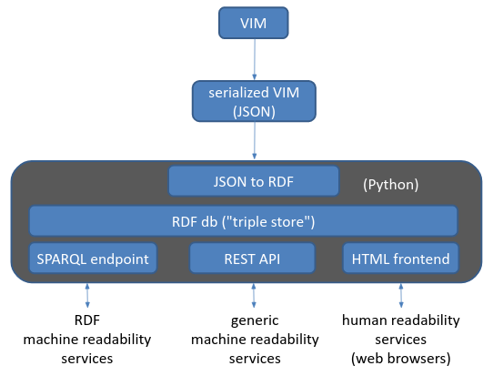

# Some experiments towards a VIM-based formal ontology

The [International Vocabulary of Metrology](https://www.bipm.org/en/committees/jc/jcgm/publications) is a [JCGM](https://www.bipm.org/en/committees/jc/jcgm) guidance document aimed at providing a foundational concept system of metrology. It is a semi-structured document, written in English (and French), with intensional definitions compliant with [ISO 704](https://www.iso.org/standard/79077.html).  
Together with the official PDF version, [an HTML, interactive version of the VIM](https://jcgm.bipm.org/vim/en) was developed and made freely available: hence, that is a human-oriented tool.  
This is instead an experiment to develop a **machine-oriented** (e.g., machine-readable) version of the VIM, in the form of an RDF triple store, more or less according to this diagram:  
  
where, of course, the RDF db could be integrated or made interoperable with information coming from other sources, for example and in particular ontologies about units.

The core module is `vimrdf.py`, that depends only on [rdflib](https://rdflib.readthedocs.io/en/stable) and that defines the class `VIMRDF` that provides several methods to:
* read a properly formatted JSON file with the VIM information (the current, very partial, example is `vimrdf.json`, which includes a few entries from VIM, Chapter 1, in English and other sample languages (French and Italian)) and create the structure of the db;
* optionally read properly formatted JSON files with exemplary instances (at the moment, very partial examples are about kinds of quantities (`vimkinds.json`) and units (`vimunits.json`)) and populate the previously created db;
* serialize / dump the content of the db to a TTL/RDF-XML/JSON-LD/... file;
* reload the content of the db from a TTL/RDF-XML/JSON-LD/... file;
* variously query the db, with Python or SPARQL calls.

At the moment two samples are provided, both importing `vimrdf.py`, creating an instance of `VIMRDF`, creating a db and populating it from a JSON file:
* `vimrdftest.py` displays a menu of exemplary Python calls and executes the chosen one;
* `vimrdfquery.py` displays a menu of exemplary SPARQL calls and executes the chosen one.

---
**Changes with respect to the previous version:**

***13 Feb 23:***
* revised all query methods for handling terms and definitions in multiple languages.

***12 Feb 23:***
* some query methods adapted for handling terms and definitions in multiple languages.

***11 Feb 23:***
* extended the JSON schema to handle terms and definitions in multiple languages and adapted the related Python methods accordingly (query methods still to be adapted);
* added the method to populate the RDF db by reloading a TTL file generated by dumping the db itself. 

---
**Open issues:**
* scope: only ch 1 or more? (up to the entire VIM)
* primitives: how to deal with concepts whose superordinate is a primitive?
    * subclasses of external superclasses when known 
    * subclasses of VIMEntity
    * subclasses of defined ("dummy") superclasses
    * ...
* relational properties other than subClassOf: how to deal with them?
* should VIMRDF methods better return the reference to an entry as its subject or its term?
* for a minimally serious development, an appropriate namespace will need to be chosen and a licence will need to be added
* a third sample could be added exposing an API, for example through a [FastAPI](https://fastapi.tiangolo.com) server
